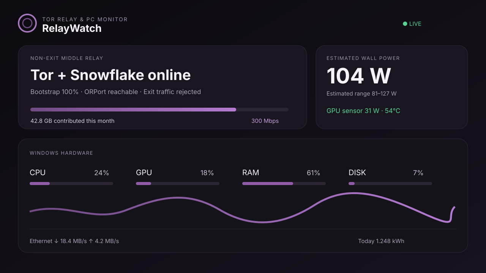

# RelayWatch

**A privacy-first Windows Tor relay dashboard, PC hardware monitor, desktop widget, and macOS menu bar companion.**

[Türkçe dokümantasyon](docs/README.tr.md)

[](https://www.microsoft.com/windows/)
[](https://support.apple.com/macos)
[](https://community.torproject.org/relay/)
[](LICENSE)

RelayWatch combines live Tor middle-relay traffic, Snowflake proxy statistics, CPU/GPU/RAM/disk/network telemetry, estimated power use, a small Windows desktop widget, and a read-only macOS menu bar app. Remote access is designed for a private [Tailscale](https://tailscale.com/) network.



## Why RelayWatch?

- Monitor a Windows Tor **middle/non-exit relay** without exposing an admin panel to the public internet.
- See relay bandwidth, bootstrap, reachability, consensus status, Snowflake connections, and total contributed traffic.
- Track CPU, GPU, memory, disks, network throughput, temperatures, component power sensors, and top processes.
- Keep collecting data before logon by running the Windows tasks as `SYSTEM`.
- Check the PC from a Mac menu bar app over Tailscale.
- Change bandwidth and accounting settings only from Windows localhost; remote clients stay read-only.

## Security model

RelayWatch does not turn a relay into an exit node. Your Tor configuration should contain:

```text
SocksPort 0
ExitRelay 0
ExitPolicy reject *:*
```

The installer creates an inbound rule for the dashboard port that accepts only Tailscale IPv4 and IPv6 ranges. It does **not** change the Tor ORPort, router forwarding, Tailscale, Remote Desktop, file sharing, or Snowflake configuration.

The API deliberately allows settings changes only from loopback (`127.0.0.1` or `::1`). Treat relay nickname, fingerprint, public ContactInfo, IP addresses, and logs as potentially sensitive operational information.

## Requirements

- Windows 10/11 x64
- An existing Tor relay installation whose `torrc` is under `C:\ProgramData\TorRelay` by default
- Node.js 22 or newer
- Administrator access for installation
- Optional: Tailscale on Windows and macOS
- Optional: macOS 13 or newer with Apple command-line developer tools

RelayWatch downloads the pinned official [LibreHardwareMonitor 0.9.6](https://github.com/LibreHardwareMonitor/LibreHardwareMonitor/releases/tag/v0.9.6) archive and verifies its SHA-256 checksum during Windows installation.

## Windows quick start

Download or clone the repository, open PowerShell as Administrator, then run:

```powershell
Set-ExecutionPolicy -Scope Process Bypass
.\windows\install.ps1 -InstallWidget
```

If your Tor files live elsewhere:

```powershell
.\windows\install.ps1 -TorRoot 'D:\TorRelay' -DashboardPort 17657 -InstallWidget
```

Open the local dashboard:

```text
http://127.0.0.1:17657
```

From another device on the same tailnet, use the Windows PC's Tailscale IP:

```text
http://100.x.y.z:17657
```

## macOS menu bar app

1. Install and connect Tailscale on both devices.
2. Copy the `macos` folder to the Mac.
3. In Terminal, run `zsh build.command` from that folder.
4. Enter the Windows PC's Tailscale IP in RelayWatch and choose **Connect**.
5. Optionally move `build/RelayWatch.app` to Applications and add it under **System Settings → General → Login Items**.

The Mac app is read-only. It does not run a relay or proxy on the Mac.

## Power readings and Corsair PSUs

The PSU wattage printed on the label—650 W, 750 W, and so on—is maximum capacity, not continuous consumption.

RelayWatch uses real component sensors where LibreHardwareMonitor exposes them. It estimates missing CPU/system/PSU losses and labels the total wall-power value as an estimate. A standard PSU has no software data connection. Some digital Corsair RMi/HXi models can expose telemetry through an internal USB connection and iCUE, but RelayWatch does not currently integrate iCUE.

For accurate whole-PC energy measurement, use a reputable external smart plug or power meter with local API access.

## Data and ports

| Item | Default |
| --- | --- |
| Install directory | `C:\ProgramData\RelayWatch` |
| Dashboard | TCP `17657` |
| Dashboard exposure | Tailscale ranges only |
| Hardware sampling | Every 2 seconds |
| Browser refresh | Every 5 seconds |
| macOS refresh | Every 10 seconds |
| Tor root | `C:\ProgramData\TorRelay` |

Energy history and relay traffic counters stay on the Windows PC. No analytics or third-party telemetry is included.

## Uninstall

Run as Administrator:

```powershell
.\windows\uninstall.ps1
```

The uninstaller removes RelayWatch tasks, its firewall rule, widget shortcut, and installed files. It does not remove Tor, Snowflake, Tailscale, or their data. Use `-KeepData` to keep the RelayWatch data directory.

## Project layout

```text
windows/
  install.ps1
  uninstall.ps1
  hardware-monitor.ps1
  widget.ps1
  dashboard/
macos/
  Sources/RelayWatchApp.swift
  build.command
docs/
```

## Contributing

Bug reports, sensor compatibility results, translations, accessibility improvements, and safe integrations for local power meters are welcome. Read [CONTRIBUTING.md](CONTRIBUTING.md) and [SECURITY.md](SECURITY.md) before submitting changes.

## Disclaimer

RelayWatch is an independent community project. It is not affiliated with or endorsed by The Tor Project, Tailscale, Corsair, or LibreHardwareMonitor. Run relays in accordance with your local laws, ISP terms, and the official Tor relay documentation.

## License

[MIT](LICENSE)
